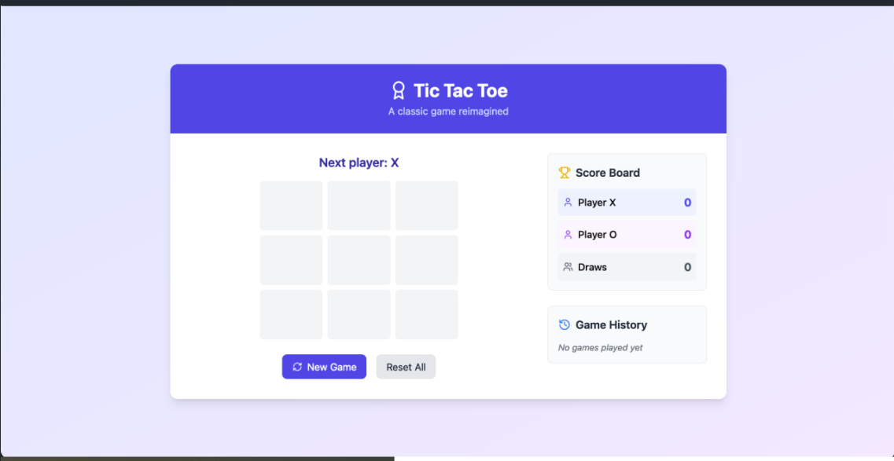

# DevSecOps TicTacToe Demo Project

This project demonstrates a complete DevSecOps pipeline implementation using a simple TicTacToe game built with React, TypeScript, and Vite. It showcases modern DevSecOps practices with continuous integration, security scanning, and automated deployment.

## What is DevSecOps?

DevSecOps is an evolution of DevOps that integrates security practices into every phase of the software development lifecycle. While DevOps focuses on breaking down barriers between development and operations teams to enable faster delivery, DevSecOps goes a step further by making security an integral part of the development process rather than an afterthought.

Key differences between DevOps and DevSecOps:
- **DevOps**: Focuses on automation, continuous integration, and continuous delivery (CI/CD) to speed up development and deployment cycles.
- **DevSecOps**: Maintains the speed of DevOps while adding security checks and controls throughout the pipeline, including:
  - Code security scanning
  - Dependency vulnerability checks
  - Container security scanning
  - Infrastructure-as-Code security validation
  - Runtime security monitoring

## Project Overview

### Game Description
The project features a classic Tic-tac-toe game where:
- Two players take turns marking spaces on a 3×3 grid
- Players use X and O as their markers
- The first player to get three of their marks in a row (horizontally, vertically, or diagonally) wins
- If all squares are filled and no player has won, the game is a draw

### Game Screenshot


### Project Structure
```
src/
├── components/
│   ├── Board.tsx       # Game board component
│   ├── Square.tsx      # Individual square component
│   ├── ScoreBoard.tsx  # Score tracking component
│   └── GameHistory.tsx # Game history component
├── utils/
│   └── gameLogic.ts    # Game logic utilities
├── App.tsx             # Main application component
└── main.tsx           # Entry point
```

## DevSecOps Architecture


The architecture implements a comprehensive DevSecOps pipeline with the following stages:

1. **Development**:
   - Local development with React & TypeScript
   - Code quality checks with ESLint
   - Unit testing with Jest

2. **Version Control & CI (GitHub)**:
   - Code hosting and version control
   - Automated testing
   - Security scanning
   - Code quality analysis

3. **Container Registry**:
   - Image scanning
   - Vulnerability assessment
   - Image versioning

4. **Continuous Deployment**:
   - ArgoCD for GitOps
   - Automated deployments
   - Configuration management

5. **Production (Kubernetes)**:
   - Container orchestration
   - High availability
   - Auto-scaling
   - Health monitoring

This project implements a full DevSecOps pipeline with the following components:

1. **Application Layer**:
   - React + TypeScript frontend
   - Vite for build optimization
   - ESLint for code quality

2. **Container Layer**:
   - Multi-stage Dockerfile for optimized builds
   - Nginx as the production web server

3. **CI/CD Pipeline**:
   - GitHub Actions for CI/CD workflow
   - ArgoCD for GitOps-based deployments
   - Kubernetes for container orchestration

## Local Development

### Prerequisites
- Node.js (v20 or later)
- npm (Latest version)
- Docker (for container builds)
- kubectl (for Kubernetes deployment)

### Running Locally

1. Install dependencies:
```bash
npm install
```

2. Start development server:
```bash
npm run dev
```

3. Build for production:
```bash
npm run build
```

## DevSecOps Pipeline Workflow

### 1. Continuous Integration (GitHub Actions)

Our CI pipeline (`CI-CD.yml`) includes the following stages:

a) **Test Stage**:
   - Runs unit tests
   - Validates code functionality

b) **Static Analysis**:
   - ESLint for code quality
   - TypeScript type checking
   - Security scanning

c) **Build Stage**:
   - Compiles TypeScript
   - Bundles application
   - Creates optimized production build

d) **Container Stage**:
   - Builds Docker image
   - Scans container for vulnerabilities
   - Pushes to GitHub Container Registry

### 2. Continuous Deployment (ArgoCD)

The CD process is handled by ArgoCD, implementing GitOps principles:

1. **ArgoCD Setup**:
   - Monitors the Kubernetes manifests in the `kubernetes/` directory
   - Automatically syncs changes to the cluster
   - Ensures desired state matches actual state

2. **Deployment Strategy**:
   - Uses rolling updates for zero-downtime deployments
   - Implements health checks and readiness probes
   - Automatically scales based on demand

### 3. Kubernetes Configuration

The application is deployed to Kubernetes with the following specifications:

- 3 replicas for high availability
- Resource limits and requests defined
- Liveness and readiness probes configured
- Automatic container registry secret management

## Deployment

### Prerequisites for Deployment:
1. A Kubernetes cluster
2. ArgoCD installed on the cluster
3. Access to GitHub Container Registry

### Setting up ArgoCD:

1. Install ArgoCD:
```bash
kubectl create namespace argocd
kubectl apply -n argocd -f https://raw.githubusercontent.com/argoproj/argo-cd/stable/manifests/install.yaml
```

2. Configure your application in ArgoCD:
```bash
kubectl apply -f kubernetes/deployment.yaml
```

### Accessing the Application:

Once deployed, the application will be available through your Kubernetes cluster's ingress or LoadBalancer service (configuration may vary based on your setup).

## Security Features

This pipeline implements several security best practices:

1. **Container Security**:
   - Multi-stage builds to minimize attack surface
   - Non-root user in production container
   - Minimal base images

2. **Infrastructure Security**:
   - Resource limits to prevent DoS
   - Network policies (if implemented)
   - Secret management through Kubernetes

3. **Application Security**:
   - Dependency scanning
   - Static code analysis
   - Regular security updates

## Contributing

1. Fork the repository
2. Create your feature branch: `git checkout -b feature/AmazingFeature`
3. Commit your changes: `git commit -m 'Add some AmazingFeature'`
4. Push to the branch: `git push origin feature/AmazingFeature`
5. Open a Pull Request

## License

This project is licensed under the MIT License - see the LICENSE file for details


